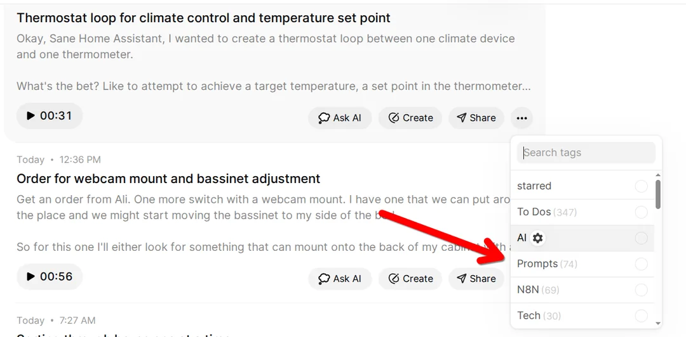

# Voicenotes → AI Prompts → Email Workflow (N8N)

[](https://n8n.io/)
[](https://voicenotes.com/app)
[](https://openrouter.ai/)
[](https://gmail.com)
[](https://nocodb.com/)

An automated N8N workflow that transforms voice notes into AI-processed prompts and delivers the results via email. This workflow integrates [Voicenotes](https://voicenotes.com/app), OpenRouter AI, NocoDB for storage, and Gmail for delivery.

**About Voicenotes:** [Voicenotes](https://voicenotes.com/app) is a powerful voice recording and transcription app that offers reliable speech-to-text conversion with webhook integration capabilities. It's particularly useful for capturing thoughts, ideas, and prompts on-the-go with high-quality transcription accuracy.

## Overview

This workflow addresses a common challenge: typing detailed AI prompts is time-consuming, but voice input to AI tools often has unreliable transcription. By separating transcription (via Voicenotes) from AI processing, you get better control, reliability, and the ability to batch or refine prompts before processing.

**Key Benefits:**
- Reliable voice-to-text transcription via Voicenotes
- Automated AI processing with customizable system prompts
- Dual storage: database records + formatted email delivery
- Flexible webhook-based triggering with tag filtering

## Workflow Architecture


The workflow consists of several key components:

### 1. Webhook Trigger


The workflow begins with a webhook that receives tagged voice notes from Voicenotes. The webhook is configured to trigger only when notes are tagged with a specific tag (e.g., `#prompt`).

### 2. Data Processing


Incoming webhook data is processed to extract:
- Note title
- Transcript content
- Timestamp
- Other metadata

### 3. AI Processing


The transcript is sent to an AI agent (via OpenRouter) with a customized system prompt that ensures:
- Detailed, thorough responses
- Well-structured documents with headers
- Comparison tables when relevant
- Executive summaries
- Proper source citations

### 4. Dual Storage System


Both the original prompt and AI response are stored in NocoDB for:
- Historical tracking
- Search capabilities
- Analytics and reporting

### 5. Email Delivery


The AI response is formatted as HTML and sent via Gmail with:
- Professional styling
- Clear prompt/response separation
- Responsive design
- Custom sender name

### 6. Complete Workflow View


The complete workflow showing all nodes and their connections.

## Setup Instructions

### Prerequisites

- N8N instance (self-hosted or cloud)
- Voicenotes account with webhook access
- OpenRouter API account
- NocoDB instance for data storage
- Gmail account with OAuth2 setup

### Step 1: Voicenotes Configuration

1. In Voicenotes, go to **Menu → Integrations → Webhooks**
2. Create a new webhook filtered by your chosen tag (e.g., `#prompt`)
3. Set the webhook URL to your N8N webhook endpoint
4. Configure to trigger on "tag assigned" events

### Step 2: Import the Workflow

1. Download the `workflow-redacted.json` file
2. In N8N, go to **Workflows** and click **Import from File**
3. Select the downloaded JSON file
4. The workflow will be imported with placeholder credentials

### Step 3: Configure Credentials

Replace the placeholder values in the workflow:

#### Webhook Node
- Update `path` and `webhookId` with your N8N webhook details

#### OpenRouter Configuration
- Add your OpenRouter API credentials
- Adjust the AI model if desired (currently set to `anthropic/claude-sonnet-4`)

#### NocoDB Setup
- Configure your NocoDB connection
- Update `projectId` and table IDs for both prompt and output storage
- Ensure your NocoDB tables have the required fields:
  - **Prompts table**: title, prompt, created
  - **Outputs table**: title, prompt, output, created

#### Gmail Configuration
- Set up Gmail OAuth2 credentials
- Update the recipient email address
- Customize the sender name if desired

### Step 4: Customize the System Prompt

The AI Agent node contains a system prompt that can be customized for your needs. The current prompt instructs the AI to:
- Provide detailed, thorough responses
- Structure documents with clear headers
- Include comparison tables when relevant
- Add executive summaries
- Cite sources properly

### Step 5: Test the Workflow

1. Activate the workflow in N8N
2. Record a voice note in Voicenotes
3. Tag it with your configured tag (e.g., `#prompt`)
4. Monitor the workflow execution in N8N
5. Check your email for the formatted response
6. Verify data storage in NocoDB

## Workflow Details

### Data Flow

1. **Voice Note Creation**: User records a voice note in Voicenotes
2. **Tagging**: User applies the trigger tag (e.g., `#prompt`)
3. **Webhook Trigger**: Voicenotes sends webhook payload to N8N
4. **Data Extraction**: N8N extracts title, transcript, and timestamp
5. **AI Processing**: Transcript sent to OpenRouter AI with system prompt
6. **Data Storage**: Both prompt and response saved to NocoDB
7. **Email Formatting**: Response converted to HTML format
8. **Email Delivery**: Formatted email sent via Gmail

### JSON Payload Structure

Voicenotes sends a webhook payload like:

```json
{
  "event": "tag_assigned",
  "body": {
    "timestamp": "2024-01-01T12:00:00Z",
    "data": {
      "title": "Note title here",
      "transcript": "Full note content here"
    }
  }
}
```

### Email Template

The workflow generates HTML emails with:
- Professional styling with responsive design
- Clear separation between prompt and AI response
- Color-coded sections (green for prompt, blue for response)
- Proper typography and spacing

## Customization Options

### AI Model Selection
Change the OpenRouter model in the "OpenRouter Chat Model" node. Popular options:
- `anthropic/claude-sonnet-4`
- `openai/gpt-4`
- `google/gemini-pro`

### Storage Alternatives
Replace NocoDB with:
- Airtable
- Google Sheets
- PostgreSQL
- Any database supported by N8N

### Delivery Options
Replace Gmail with:
- Slack notifications
- Discord webhooks
- Telegram messages
- File storage (Google Drive, Dropbox)

### Tag-Based Routing
Extend the workflow to handle multiple tags:
- Different AI models for different tag types
- Separate storage locations
- Different email templates

## Troubleshooting

### Common Issues

1. **Webhook not triggering**
   - Verify the webhook URL in Voicenotes
   - Check N8N webhook node configuration
   - Ensure the workflow is activated

2. **AI processing fails**
   - Verify OpenRouter API credentials
   - Check API quota and billing
   - Review error logs in N8N

3. **Database storage fails**
   - Verify NocoDB credentials and connection
   - Check table structure and field names
   - Ensure proper permissions

4. **Email delivery fails**
   - Verify Gmail OAuth2 setup
   - Check recipient email address
   - Review Gmail API quotas

### Debugging Tips

- Use N8N's execution log to trace data flow
- Enable "Save Execution Data" for debugging
- Test each node individually
- Check webhook payload format in N8N logs

## Security Considerations

- Store all credentials securely in N8N's credential system
- Use environment variables for sensitive configuration
- Regularly rotate API keys
- Monitor webhook endpoint for unauthorized access
- Consider IP whitelisting for webhook endpoints

## Future Enhancements

- **Batch Processing**: Queue multiple prompts for batch processing
- **Response Refinement**: Add human-in-the-loop approval step
- **Multi-Model Routing**: Route different prompt types to different AI models
- **Analytics Dashboard**: Create reporting on prompt/response patterns
- **Integration Expansion**: Add support for more voice note apps

## Contributing

Feel free to fork this workflow and adapt it for your needs. If you create useful variations or improvements, consider sharing them with the community.

## License

This workflow is provided as-is for educational and personal use. Ensure compliance with all service terms of use (Voicenotes, OpenRouter, NocoDB, Gmail) when implementing.

---

*This workflow demonstrates the power of combining voice input, AI processing, and automated delivery to create efficient prompt-to-insight pipelines.*
